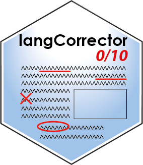

<!-- README.md is generated from README.Rmd. Please edit that file -->

# langCorrector 

## What is this package ?

This package makes it possible to use
[LanguageTool](https://languagetool.org/fr/dev) from R to correct some
text. It currently proposes a Shiny app to edit rmarkdown documents. In
the future, another app will be developed to edit packages
documentation.

## Installing

You can install this package from GitHub, maybe it will be on CRAN one
day.

To use all the new features before they are available in the CRAN
version, you can download the development version.

``` r
devtools::install_github("JeremyGelb/langCorrector")
```

You will need to download the jar file from LanguageTool.

``` r
library(langCorrector)
install_LanguageTools()
```

And check if it worked.

``` r
is_LanguageTools_installed()
```

Also, you need to ensure that java (64 bits) is installed on your
computer and can be run from the command line.

``` r
check_java()
```

If java is not installed, or if you have the 32-bits version please
[download](https://www.java.com/en/download/manual.jsp) it and install
it.

Also, if you are using Windows, you must ensure that java location was
[added to your Path](https://www.java.com/en/download/help/path.html).

Finally, you can use LanguageTool for the first time and install locally
a list of all the available languages.

``` r
install_lang_list() # need to be done only once
get_lang_list()
```

## Using the package

You want to find grammatical errors in a rmd document? The easiest
option is to use the Shiny app provided with the package!

``` r
library(langCorrector)
my_file <- 'path/to/my/rmdfile.rmd'
lang <- "en"
rmd_corrector(my_file, language = lang, port = 8807)
```

You could also decide to use it directly from R by running the
LanguageTool server manually.

``` r
my_server <- starting_server(port = 8807)
my_text <- "Some text with a obvious mistake."
corrections <- send_request(port = 8807, text = my_text, language = "en")
```

Do not forget to stop the server when you are done. You don’t want to
have orphan processes running in the background!

``` r
killing_server(my_server)
```

## Reporting a bug

If you encounter a bug when using langCorrector, please open an *issue*
[here](https://github.com/JeremyGelb/langCorrector/issues). To ensure
that the problem is quickly identified, the issue should follow the
following guidelines:

1.  Provide an informative title and do not copy-paste the error message
    as the title.
2.  Provide the ALL code which lead to the bug.
3.  Indicate the version of R and langCorrector
4.  If possible, provide a sample of data and a reproductible example.

## Authors

-   **Jeremy Gelb** - *Creator and maintainer*

## WANTED

I would like to improve the package by using rJava instead of a server
based approach, I you have some clue about how it works, feel free to
contact me!

## License

`langCorrector` is licensed under [GPL2
License](https://github.com/JeremyGelb/langCorrector/blob/master/LICENSE.txt).
